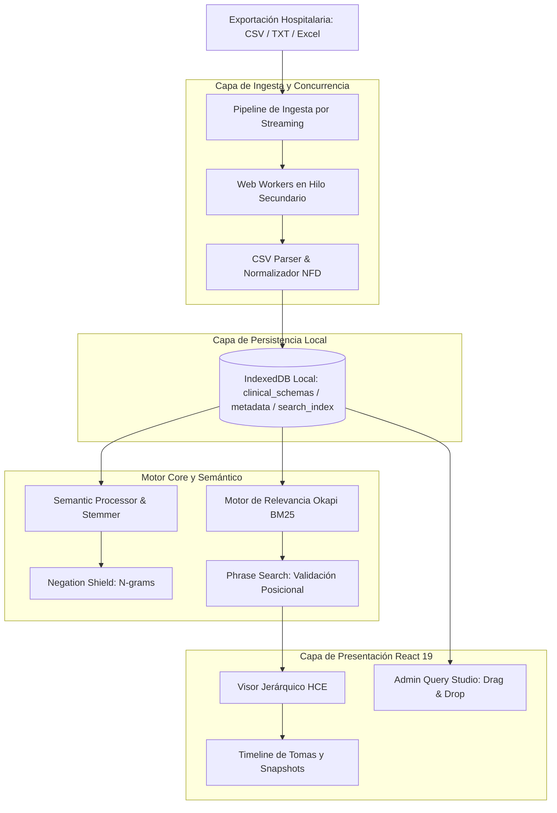

# Informe Técnico de Desarrollo y Evolución: Queryclin

## Ficha del Proyecto

| Parámetro | Detalle Técnico |
| :--- | :--- |
| **Nombre del Proyecto** | **Queryclin** — HCE Intelligence & Admin Studio |
| **Autor del Proyecto** | **Francisco Javier Alonso Fondón** (ASIR) |
| **Coordinación Clínica** | **Ignacio Martínez Soriano** (Hospital Universitario Rafael Méndez — Lorca) |
| **Versión de Release** | Core `V7.2.2-STABLE` / Admin Studio `V2.2.2-STABLE` |
| **Arquitectura** | Local-First, React 19, TypeScript, Vite, TailwindCSS |
| **Tecnologías de Soporte** | IndexedDB, Web Workers, SheetJS (XLSX), Vitest |
| **Repositorio y Web** | [xaviaerox.github.io/Queryclin/](https://xaviaerox.github.io/Queryclin/) |

---

## 1. Introducción y Planteamiento del Problema

En la práctica médica y en la investigación clínica retrospectiva, el análisis de grandes volúmenes de datos contenidos en Historias Clínicas Electrónicas (HCE) suele presentar barreras insalvables debido a la heterogeneidad de los formatos de exportación de los hospitales. La mayoría de los sistemas hospitalarios legacy exportan datos en tablas crudas o formatos planos desestructurados (CSV, TXT, XLSX). 

El procesamiento manual de estos registros introduce una gran carga cognitiva para el clínico y un riesgo elevado de omitir hallazgos clave. Por otro lado, la normativa vigente de protección de datos de carácter personal y de salud (LOPDGDD / RGPD) impide la transmisión o carga de esta información altamente sensible en servidores de terceros o APIs en la nube sin un proceso exhaustivo de anonimización.

**Queryclin** se ha diseñado como una solución de ingeniería de software a este doble reto, permitiendo la exploración de datos masivos directamente en el cliente mediante un motor de indexación local que interpreta la semántica clínica, aislando por completo la información y garantizando una privacidad absoluta.

---

## 2. Ecosistema y Arquitectura de Sistemas (Local-First)

Queryclin implementa una arquitectura **Local-First**, lo que significa que el 100% de la indexación, persistencia, normalización y búsqueda se ejecuta localmente dentro de la Sandbox de ejecución del navegador web.

### Componentes Clave de la Arquitectura
1. **IndexedDB (Capa de Almacenamiento)**: Actúa como el motor de base de datos relacional y documental en el cliente. Queryclin la utiliza para guardar el índice invertido (postings), los registros de pacientes y los esquemas dinámicos del Admin Studio en almacenes independientes.
2. **Web Workers (Capa de Concurrencia)**: Evitan que la interfaz de usuario se bloquee o muestre congelaciones ("lag") al procesar archivos masivos de hasta 100.000 registros, delegando la computación pesada (tokenización, stemming e ingesta) a un hilo de ejecución independiente del navegador.
3. **Clean Architecture**: El código fuente se estructuró de forma desacoplada para garantizar su mantenibilidad a largo plazo:
   * `src/core/`: Dominios, constantes clínicas, tipado e inicializadores estáticos.
   * `src/ingestion/`: Flujo por streaming de ficheros y normalizadores.
   * `src/storage/`: Manejo de base de datos local e IndexedDB.
   * `src/engine/`: Procesador semántico, tokenizador clínico, filtros y cálculo BM25.
   * `src/admin-studio/`: Entorno visual de diseño de esquemas y taxonomías.

---

## 3. Evolución Paso a Paso del Proyecto y Desarrollo Técnico

El ciclo de vida del desarrollo de Queryclin se divide en hitos macro-estructurales, donde cada fase refinó la escalabilidad, la precisión del buscador y la ergonomía del usuario clínico.

---

### Fase I: Cimientos y Motor Booleano Inicial (V1.0 - V2.0)
* **Objetivo**: Creación de la interfaz clínica base e implementación de un buscador determinista.
* **Hitos**:
  * Diseño del sistema visual "Clean Clinical" en escala de grises y azules fríos para mitigar la fatiga visual en turnos médicos prolongados.
  * Parser básico para interpretar columnas separadas por comas.
  * Implementación del motor de búsqueda booleano inicial (`AND`, `OR`, `NOT`) para buscar coincidencias de texto plano.
* **Limitación**: El procesamiento era puramente síncrono. Archivos de más de 5.000 registros causaban cierres por timeout o bloqueaban la pestaña del navegador.

---

### Fase II: Escalabilidad, Web Workers y Streaming (V2.1 - V3.0)
* **Objetivo**: Soportar archivos de datos de gran escala sin pérdida de rendimiento.
* **Hitos**:
  * **Migración a IndexedDB**: La base de datos local en disco reemplazó la retención de objetos en la memoria RAM del navegador.
  * **Ingesta por Streaming**: Implementación de un lector incremental (`streamCSV`) que procesa los archivos por fragmentos (Chunks) en lugar de cargarlos en memoria de una sola vez.
  * **Introducción de Web Workers**: El motor de parseo e indexación se trasladó a `csv.worker.ts`.
  * **Índice Fragmentado (Bucketing)**: Solución al error nativo de IndexedDB al intentar almacenar objetos de índice gigantescos, dividiendo los postings en fragmentos (shards) recuperables de forma independiente.
* **Logro**: Ingestas certificadas de datasets de hasta 100.000 registros clínicos (34MB) sin colapso de la interfaz.

---

### Fase III: Búsqueda de Segunda Generación e Inteligencia Semántica (V3.8 - V5.3.0)
* **Objetivo**: Superar la limitación de la búsqueda textual simple mediante el entendimiento semántico y estructural.
* **Hitos**:
  * **Adopción de Okapi BM25**: Transición desde el scoring lineal TF-IDF hacia la fórmula BM25, que introduce factores de saturación de frecuencia de término y penalización por longitud de campo.
  * **SemanticProcessor & Stemming**: Creación de un tokenizador clínico especializado que respeta nomenclaturas médicas (`Na+`, `O2Hb`, `T°`, decimales) y mapea términos mediante un diccionario unificado de sinónimos.
  * **Context-Aware Negation Tokenizer (Negation Shield)**: Implementación de detección de negaciones. Si el motor localiza palabras de exclusión ("no", "sin", "descarta") en texto libre, modifica los siguientes 3 términos clínicos indexándolos con el prefijo `neg_` (ej. `neg_hta`). Esto eliminó los falsos positivos en las búsquedas (ej. buscar "diabetes" no devolvía registros donde el médico anotó "sin diabetes").
  * **Post-Score Field Boosting**: Los términos encontrados en el bloque de "Diagnóstico" reciben un peso de relevancia de `x1.8`, en "Antecedentes" de `x1.5` y en "Resultados" de `x1.2`.
  * **Búsqueda por Frase Exacta**: Soporte para consultas entre comillas dobles (ej: `"infarto agudo de miocardio"`). El motor realiza un pre-filtrado por lotes mediante BM25 y ejecuta una validación posicional secundaria iterando sobre la cadena original para confirmar la contigüidad exacta de los términos en el registro.

---

### Fase IV: Ergonomía de Visualización y Navegación Longitudinal (V4.0 - V5.2.0)
* **Objetivo**: Facilitar la lectura continuada y la navegación temporal del historial clínico del paciente.
* **Hitos**:
  * **Línea Temporal de Tomas (Timeline)**: Agrupación interactiva del expediente del paciente basada en su identificador único (N.H.C.) y ordenada cronológicamente por `Id_Toma` y `Orden_Toma`.
  * **Modo "Última Toma" (Snapshot Retrieval)**: Desarrollo de un filtro avanzado que extrae únicamente la última toma registrada de cada paciente. Si un paciente tuvo un síntoma en 2023 pero se resolvió en 2024, buscar en 2024 en este modo no devuelve falsos positivos del historial inactivo.
  * **Resaltado Clínico Ubicuo y Scroll Contextual**: Resaltado visual interactivo en todo el cuerpo del informe y desplazamiento automático del foco de pantalla (`scrollIntoView`) hacia la sección del informe que contiene el primer hallazgo que coincide con la búsqueda.
  * **Modo Debug Persistente**: Toggle que permite al clínico visualizar metadatos ocultos, campos no mapeados y datos vacíos para auditoría de calidad.

---

### Fase V: Queryclin Admin Studio (V6.0 - V6.5)
* **Objetivo**: Integrar la gobernanza declarativa del dato y permitir la personalización estructural de formularios.
* **Hitos**:
  * **Diseñador Visual Drag-and-Drop**: Creación de una interfaz gráfica fluida que permite estructurar secciones (ej: "Constantes"), grupos y campos en tiempo real con feedback de colisión visual.
  * **Biblioteca de Recursos Clínicos**: Carga e inyección inmutable de modelos normalizados hospitalarios estándar (HCE-MIR, HCE-ALG y HCE-OBS) para que actúen como base de clonación de nuevos esquemas.
  * **SchemaValidator**: Lógica recursiva que comprueba que ningún campo dinamizado en cabeceras, barras laterales o campos no asignados duplique identificadores, previniendo colisiones de datos.
  * **Integración y Sincronización en Caliente**: Inyección del componente `DynamicSectionRenderer` en el visor clínico principal. Las plantillas personalizadas creadas en Admin Studio se aplican inmediatamente al motor de ingesta y visualización sin necesidad de tocar el código base del Core.

---

### Fase VI: Estabilización, Hardening de Rendimiento y Release (V6.5.1 - V7.2.2-STABLE)
* **Objetivo**: Preparar el ecosistema para su despliegue final en producción libre de deuda técnica o vulnerabilidades.
* **Hitos**:
  * **Caché LRU de Consultas**: Implementación de caché de hasta 100 consultas en `QueryEngine.ts` para respuestas instantáneas en búsquedas recurrentes.
  * **Cancelación Concurrente con AbortSignal**: Prevención de colisiones y race conditions en IndexedDB mediante la propagación de una señal de aborto al presionar teclas rápidamente.
  * **Passcode Gate Criptográfico**: Reemplazo del PIN de administrador en texto plano por verificación asíncrona mediante hash **SHA-256** local utilizando `Web Crypto API`.
  * **Unificación de Modo Oscuro**: Tematización semántica sincronizada de toda la aplicación mediante variables CSS nativas, eliminando colores duros e incorporando favicon oficial de marca.

---

## 4. Desafíos Técnicos Relevantes y Soluciones de Ingeniería

### A. El Desafío del Out Of Memory (OOM) en la Ingesta de Datos
Al indexar archivos de texto plano masivos, la estructura típica de un índice invertido en memoria RAM satura el recolector de basura de JavaScript. 
* **Solución**: Se implementó una arquitectura de procesamiento paralelo y persistencia fragmentada. El Web Worker lee fragmentos de registros, procesa la taxonomía semántica y los inserta inmediatamente en IndexedDB mediante transacciones de escritura rápida en lotes. La RAM del navegador se mantiene por debajo de 50MB estables en todo momento.

### B. Race Conditions por Escritura y Lectura Concurrente
Durante una indexación pesada en segundo plano, si el usuario realiza búsquedas dinámicas o recarga la página, IndexedDB puede generar bloqueos de esquema o devolver datos inconsistentes.
* **Solución**: Registro de manejadores de eventos nativos `onversionchange` y `onclose` en el flujo de conexión de `indexedDB.ts` para posibilitar reconexiones transparentes, junto a mount-guards deterministas y AbortSignals en React para interrumpir promesas en componentes que se desmontan.

### C. Cuello de Botella de Renderizado en Resultados
Renderizar una lista de más de 1.000 filas de pacientes, cada una requiriendo la recuperación de datos demográficos asociados en IndexedDB, generaba micro-bloqueos en la interfaz del usuario.
* **Solución**:
  * Agrupación de consultas mediante la función `db.getBatch` para extraer toda la información demográfica en una única transacción de base de datos por página.
  * Implementación de `React.memo` en los subcomponentes críticos del visor (`ResultRow`, `ClinicalField`, `TomaTimeline`) para evitar renderizados redundantes del árbol virtual de React (Virtual DOM).

---

## 5. Conclusiones y Futuras Líneas de Trabajo

Queryclin representa una aproximación madura y altamente eficiente para la exploración de Historias Clínicas Electrónicas. La unificación de un procesador semántico contextual con un diseñador visual declarativo proporciona una herramienta flexible para los departamentos de admisión, análisis de datos y personal médico de los centros de salud.

### Futuras Líneas de Desarrollo:
1. **Modelos del Lenguaje Locales (WebLLM / Transformers.js)**: Incorporar capacidades de síntesis y resúmenes narrativos de la evolución del paciente cargando modelos LLM optimizados (ej. Llama-3-8B-Instruct cuantizado) que se ejecuten íntegramente en la CPU/GPU local de la máquina del clínico.
2. **Estadísticas Predictivas de Parámetros Biométricos**: Módulos de análisis temporal para graficar predicciones de evolución en base a constantes (presión arterial, saturación) usando librerías de regresión local.
3. **Mapeador HL7 / FHIR**: Conectores nativos en Admin Studio para transformar esquemas FHIR XML/JSON en layouts compatibles de Queryclin sin intervención manual.
