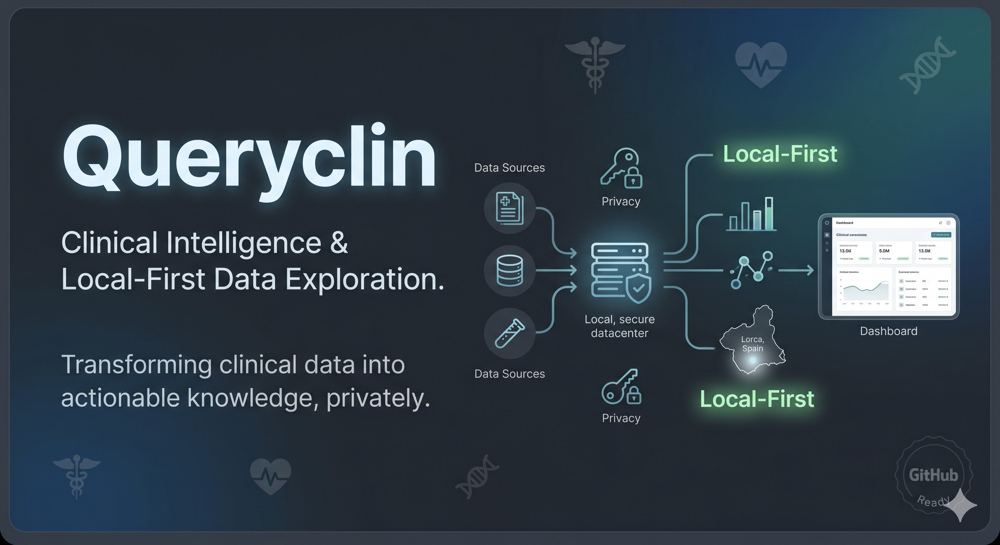

# Queryclin — HCE Intelligence & Admin Studio

<div align="center">
  
</div>

> Plataforma avanzada para exploración, auditoría y análisis estructural de Historias Clínicas Electrónicas (HCE) bajo arquitectura **Local-First**.
>
> Diseñada para transformar grandes volúmenes de datos clínicos heterogéneos en un entorno navegable, semánticamente coherente y operativamente eficiente, manteniendo privacidad absoluta y procesamiento íntegramente local.
>
> 🌐 Web oficial: https://xaviaerox.github.io/Queryclin/

---

# 1. Introducción

La digitalización sanitaria ha multiplicado exponencialmente la disponibilidad de información clínica. Sin embargo, gran parte de estos datos continúan exportándose desde sistemas hospitalarios en formatos planos y poco estructurados (CSV, Excel o texto libre), dificultando su explotación analítica y aumentando considerablemente la carga cognitiva durante procesos de auditoría, revisión clínica o investigación retrospectiva.

En este contexto, la capacidad de interpretar rápidamente grandes volúmenes de información clínica se convierte en un problema tanto tecnológico como operativo.

**Queryclin** surge como una respuesta a esta necesidad.

La plataforma ha sido concebida como un motor de exploración clínica de alta precisión capaz de procesar datasets masivos directamente en el navegador, permitiendo transformar registros desestructurados en una representación clínica navegable, cronológica y semánticamente consistente en tiempo real.

---

# 2. Objetivo del Proyecto

El propósito principal de Queryclin es proporcionar un entorno de trabajo clínico capaz de:

- Facilitar la navegación de Historias Clínicas Electrónicas complejas.
- Reducir la fricción cognitiva durante auditorías y revisiones masivas.
- Mejorar la trazabilidad temporal y estructural de los episodios clínicos.
- Permitir búsquedas clínicas avanzadas con interpretación contextual.
- Garantizar privacidad total mediante procesamiento exclusivamente local.

La plataforma no pretende sustituir sistemas hospitalarios existentes, sino actuar como una capa de inteligencia y exploración sobre exportaciones clínicas ya disponibles.

---

# 3. Principios Fundamentales de Arquitectura

## 🛡️ Local-First y Privacidad Absoluta

Debido a la sensibilidad inherente de los datos sanitarios, Queryclin adopta una arquitectura estrictamente *Local-First*.

Todo el procesamiento, indexación y persistencia se ejecuta íntegramente en el navegador mediante:

- IndexedDB
- Web Workers
- Memoria local del cliente

Los datos nunca son transmitidos a servidores externos ni a servicios de terceros.

---

## 🧠 Integridad Semántica del Dato

El sistema incorpora un motor semántico especializado capaz de:

- Expandir terminología clínica equivalente.
- Detectar negaciones contextuales.
- Interpretar relaciones estructurales implícitas.
- Reducir falsos positivos en búsquedas médicas.

Esto permite realizar consultas clínicamente coherentes incluso sobre datasets heterogéneos o parcialmente inconsistentes.

---

## ⚖️ Gobernanza y Fidelidad Clínica

Queryclin mantiene una política estricta de:

- No alteración destructiva del dato original.
- Trazabilidad completa de cambios.
- Separación arquitectónica de responsabilidades.
- Exclusión total de datos clínicos reales en entornos públicos.

---

# 4. Ecosistema Queryclin

La plataforma se estructura en dos grandes módulos complementarios.

---

## 🔍 Queryclin — Core Engine & Clinical Viewer

Motor principal de búsqueda y visualización clínica.

Su función es interpretar la estructura implícita de la Historia Clínica Electrónica y convertirla en una experiencia navegable y contextual.

### Capacidades principales

- Búsqueda clínica booleana (`AND / OR / NOT`)
- Navegación cronológica por tomas clínicas
- Filtrado contextual avanzado
- Resaltado semántico de hallazgos
- Interpretación estructural de antecedentes, diagnósticos y resultados
- Visualización jerárquica de episodios clínicos

El sistema permite aislar episodios específicos sin perder la visión longitudinal completa del paciente.

---

## 🧩 Queryclin Admin Studio

Entorno de diseño clínico declarativo orientado a la gobernanza estructural del dato.

Permite construir formularios dinámicos y taxonomías clínicas mediante una interfaz visual *Drag-and-Drop*.

### Funcionalidades

- Diseño de formularios clínicos dinámicos
- Definición de estructuras desde cero
- Reutilización de modelos hospitalarios estándar (MIR, OBS, ALG)
- Gestión de secciones y grupos clínicos
- Control de taxonomías y mappings
- Persistencia estructural avanzada

Admin Studio actúa como capa institucional de normalización y consistencia semántica.

---

# 5. Evolución Tecnológica del Proyecto

La evolución de Queryclin ha estado orientada a tres objetivos principales:

- Escalabilidad
- Precisión clínica
- Robustez operativa

---

## Primera etapa — Motor de exploración clínica

Desarrollo inicial del sistema de indexación y búsqueda booleana avanzada.

Durante esta fase se validó la capacidad de procesar datasets clínicos de gran escala directamente en cliente.

### Hitos

- Soporte para más de 100.000 registros
- Procesamiento paralelo mediante Web Workers
- Persistencia fragmentada en IndexedDB
- Pipeline de ingestión por streaming

---

## Segunda etapa — Inteligencia semántica y navegación contextual

Introducción del procesador semántico y del sistema de navegación cronológica por tomas clínicas.

### Hitos

- SemanticProcessor
- Expansión de sinónimos clínicos
- Negation Shielding
- Timeline clínico contextual
- Field Boosting estructural

---

## Etapa actual — Estabilización de producción

La plataforma se encuentra actualmente en fase de consolidación arquitectónica y endurecimiento operativo (*Production Freeze*).

### Mejoras recientes

- Optimización avanzada de memoria
- Prevención de Out-Of-Memory (OOM)
- Recuperación automática ante fallos
- Gestión resiliente de IndexedDB
- Eliminación de condiciones de carrera
- Cacheado y optimización de consultas

---

# 6. Framework Tecnológico

Queryclin ha sido desarrollado utilizando:

- **React 19**
- **TypeScript**
- **Vite**
- **TailwindCSS**
- **IndexedDB**
- **Web Workers**

La arquitectura sigue principios de **Clean Architecture**, garantizando desacoplamiento entre:

- Dominio clínico
- Motor semántico
- Persistencia
- Ingesta
- Interfaz de usuario

---

# 7. Organización del Código Fuente

```text
src/
├── core/        # Dominio clínico y taxonomías
├── ingestion/   # Ingesta y procesamiento paralelo
├── storage/     # Persistencia local e IndexedDB
├── engine/      # Motor semántico y búsqueda clínica
├── components/  # UI clínica y visualización HCE
└── admin-studio/# Diseño declarativo y gobernanza
```

---

# 8. Gobernanza Híbrida y Desarrollo Asistido por IA

El proyecto incorpora un modelo de gobernanza híbrida orientado al desarrollo coordinado entre ingeniería humana y agentes de inteligencia artificial.

Toda la lógica organizativa y normativa se centraliza mediante:

- `RULES.md`
- `TASKS.md`
- `CHANGELOG.md`
- Directorio `.ag/`

Este sistema garantiza:

- Trazabilidad completa
- Persistencia histórica
- Coherencia arquitectónica
- Protección de la integridad clínica
- Control estricto de evolución del software

---

# 9. Desafíos Técnicos Relevantes

## Gestión de Memoria a Gran Escala

Uno de los principales retos del proyecto fue evitar bloqueos del navegador durante el procesamiento de datasets clínicos masivos.

La solución requirió:

- Procesamiento paralelo
- Fragmentación inteligente
- Streaming incremental
- Cachés optimizados
- Persistencia desacoplada

---

## Interpretación del Contexto Clínico

La búsqueda textual tradicional resulta insuficiente en entornos sanitarios.

Se desarrolló un sistema de interpretación contextual capaz de discriminar entre:

- Hallazgos positivos
- Negaciones clínicas
- Contextos históricos
- Variantes terminológicas

Esto permitió reducir falsos positivos críticos durante auditorías clínicas.

---

## Normalización de Datos Legacy

La heterogeneidad de exportaciones hospitalarias obligó a construir un sistema de unificación no destructiva capaz de interpretar:

- Cabeceras inconsistentes
- Estructuras incompletas
- Variaciones semánticas
- Modelos históricos legacy

---

# 10. Documentación del Proyecto

| Documento | Descripción |
|---|---|
| `TASKS.md` | Hoja de ruta y evolución histórica del sistema |
| `CHANGELOG.md` | Registro cronológico de modificaciones |
| `RULES.md` | Constitución técnica y reglas de gobernanza |
| `SAFE_CONTRIBUTING.md` | Directrices de seguridad para contribuciones |

---

# 11. Estado Actual

### Versión estable
`V7.x — STABLE`

### Estado del proyecto
- Arquitectura estabilizada
- APIs semánticas congeladas
- Sistema preparado para escalado funcional
- Optimización activa de robustez y experiencia clínica

---

# 12. Líneas Futuras de Investigación

Las siguientes etapas contemplan:

- Sistemas semánticos híbridos
- Integración de Transformers.js
- IA generativa local
- Resumen clínico automatizado
- Modelos predictivos ejecutados íntegramente en cliente

---

# 13. Créditos y Dirección del Proyecto

### Autor del Proyecto
**Francisco Javier Alonso Fondón**  
Técnico Superior en Administración de Sistemas Informáticos en Red (ASIR)

### Coordinación Técnica y Clínica
**Ignacio Martínez Soriano**  
Jefe de Sección de Análisis de Datos  
Hospital Universitario Rafael Méndez — Lorca (Murcia)

---

# 14. Aviso de Seguridad y Privacidad

⚠️ Este repositorio y su despliegue asociado son públicos.

Queda estrictamente prohibida la utilización o carga de datos clínicos reales.

Todos los datasets incluidos en el proyecto son sintéticos, anonimizados o generados exclusivamente con fines de validación técnica y demostración.